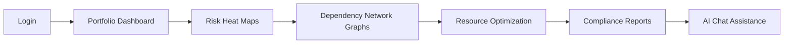

# Epic Dependency Diagram & Sequencing Plan

## Executive Summary

This document addresses the critical sequencing issues identified in the PO Master Checklist by providing explicit epic dependencies, user flow progression, and development sequencing for the AI-Powered Government Performance Management Dashboard.

## Epic Dependency Matrix

| Epic | Dependencies | Must Complete Before | Critical Path |
|------|--------------|---------------------|---------------|
| **Epic 1: Foundation & Core Infrastructure** | None | Epic 2, 3, 4, 5, 6, 7 | ✅ Critical Path |
| **Epic 2: Role-Based Dashboard Framework** | Epic 1 | Epic 3, 4, 5 | ✅ Critical Path |
| **Epic 3: PMI Compliance Monitoring System** | Epic 1, Epic 2 | Epic 4, Epic 5 | ✅ Critical Path |
| **Epic 4: AI Prediction Engine Integration** | Epic 1, Epic 2, Epic 3 | Epic 5, Epic 6 | ✅ Critical Path |
| **Epic 5: Advanced Visualization & Analytics** | Epic 2, Epic 3, Epic 4 | Epic 6, Epic 7 | ✅ Critical Path |
| **Epic 6: Government System Integration** | Epic 1, Epic 4 | Epic 7 | ⚠️ Parallel Path |
| **Epic 7: Advanced AI Features & Optimization** | Epic 4, Epic 5, Epic 6 | None | 🔄 Enhancement Path |

## Development Sequencing

### Phase 1: Foundation (Epic 1)
**Duration:** 2-3 weeks
**Dependencies:** None
**Critical Path:** Yes

**Sequencing:**
1. Project scaffolding and monorepo setup
2. Core data models (Project, Portfolio, Risk, User)
3. Authentication and authorization framework
4. Basic Convex backend functions
5. Development environment configuration

### Phase 2: Core Dashboard (Epic 2 + Epic 3)
**Duration:** 3-4 weeks  
**Dependencies:** Epic 1 complete
**Critical Path:** Yes

**Sequencing:**
1. Role-based dashboard components
2. Basic data visualization (charts, tables)
3. PMI compliance rule engine
4. Compliance scoring algorithms
5. Audit report generation

### Phase 3: AI Integration (Epic 4)
**Duration:** 2-3 weeks
**Dependencies:** Epic 1, Epic 2, Epic 3 complete
**Critical Path:** Yes

**Sequencing:**
1. Llama AI API integration
2. Prediction data models and storage
3. Risk assessment workflows
4. Confidence scoring implementation
5. AI reasoning and recommendations

### Phase 4: Advanced Features (Epic 5 + Epic 6)
**Duration:** 3-4 weeks
**Dependencies:** Epic 2, Epic 3, Epic 4 complete
**Critical Path:** Mixed

**Sequencing:**
1. **Epic 5:** Risk heat maps, dependency graphs, natural language summaries
2. **Epic 6:** Government system API adapters, data transformation pipelines
3. Real-time data synchronization
4. Cross-epic integration testing

### Phase 5: Optimization (Epic 7)
**Duration:** 2-3 weeks
**Dependencies:** Epic 4, Epic 5, Epic 6 complete
**Critical Path:** No

**Sequencing:**
1. Root cause analysis enhancements
2. Continuous learning from project data
3. Performance optimization
4. Advanced AI model fine-tuning

## User Flow Progression

### Executive User Journey

### Portfolio Manager Journey

### Project Officer Journey

## Cross-Epic Dependencies

### Shared Components Timeline
| Component | Created In Epic | Used By Epics | Critical Path |
|-----------|-----------------|---------------|---------------|
| **Authentication System** | Epic 1 | All epics | ✅ Yes |
| **Data Models** | Epic 1 | All epics | ✅ Yes |
| **Dashboard Framework** | Epic 2 | Epic 3, 4, 5, 7 | ✅ Yes |
| **Compliance Engine** | Epic 3 | Epic 4, 5, 7 | ✅ Yes |
| **AI Prediction Service** | Epic 4 | Epic 5, 6, 7 | ✅ Yes |
| **Government API Adapters** | Epic 6 | Epic 7 | ⚠️ Conditional |

### Integration Points
1. **Epic 1 → Epic 2:** Authentication + Dashboard framework
2. **Epic 2 → Epic 3:** Dashboard + Compliance monitoring
3. **Epic 3 → Epic 4:** Compliance data + AI predictions
4. **Epic 4 → Epic 5:** Predictions + Advanced visualization
5. **Epic 4 → Epic 6:** AI insights + Government data
6. **Epic 5 → Epic 7:** Analytics + Advanced AI features

## Risk Mitigation for Sequencing

### Critical Path Risks
1. **Epic 1 Delays:** Would block all subsequent epics
   - **Mitigation:** Keep Epic 1 scope minimal, focus on core infrastructure only
   
2. **AI Integration Complexity (Epic 4):** Could impact Epic 5 and Epic 7
   - **Mitigation:** Implement fallback mock AI service for development

3. **Government System Integration (Epic 6):** External dependency risk
   - **Mitigation:** Develop with mock government APIs initially

### Parallel Development Opportunities
- **Epic 5 and Epic 6** can be developed in parallel once Epic 4 is complete
- **Epic 7** can start once core AI features in Epic 4 are stable
- Frontend components can be developed alongside backend services

## External Service Sequencing

### Llama AI Integration
**Phase:** Epic 4
**Prerequisites:**
- Core data models (Epic 1)
- Basic dashboard framework (Epic 2)
- Compliance data structure (Epic 3)

**Setup Sequence:**
1. Provider selection and account setup
2. API key configuration and secure storage
3. Development environment integration
4. Production deployment configuration

### Government System Integration  
**Phase:** Epic 6
**Prerequisites:**
- Core authentication (Epic 1)
- AI prediction service (Epic 4)
- Data transformation pipelines

**Setup Sequence:**
1. Government system API documentation review
2. Authentication protocol implementation
3. Data mapping and transformation logic
4. Integration testing with government systems

## Validation Against PO Master Checklist

### ✅ Resolved Critical Issues
1. **Feature Sequencing Ambiguity** - Clear epic dependencies defined
2. **User Flow Progression** - Explicit user journey sequencing
3. **Cross-Epic Dependencies** - Comprehensive dependency matrix

### ✅ Addressed Quality Improvements
1. **Package Management** - Monorepo structure with Turborepo
2. **Migration Strategy** - Data evolution handled in Epic 1
3. **API Failure Handling** - Fallback mechanisms for external services

## Next Steps

1. **Immediate:** Begin Epic 1 development with this sequencing plan
2. **Short-term:** Create detailed stories for Epic 1 following this dependency structure
3. **Ongoing:** Use this diagram for sprint planning and dependency management

---
*Created: 10/25/2025*  
*Author: Sarah (Product Owner)*  
*Status: Approved for Development*
