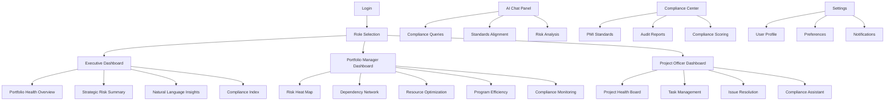
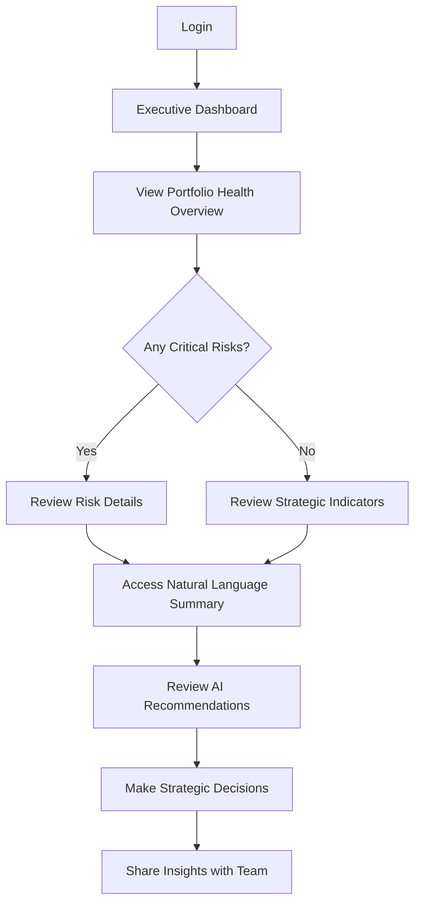
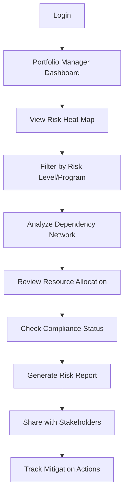

# AI-Powered Government Performance Management Dashboard UI/UX Specification

## Introduction

This document defines the user experience goals, information architecture, user flows, and visual design specifications for AI-Powered Government Performance Management Dashboard's user interface. It serves as the foundation for visual design and frontend development, ensuring a cohesive and user-centered experience.

### Overall UX Goals & Principles

#### Target User Personas

**Executive Leadership (Ministry Directors & Deputy Ministers):**
- Senior government officials (45-60 years old) with 15+ years experience
- Responsible for multiple project portfolios worth $50M+ annually
- Focus on strategic oversight rather than operational details
- Need real-time visibility into portfolio health without operational details
- Require natural language summaries for quick decision-making

**Portfolio & Program Managers:**
- Mid-career professionals (30-50 years old) with PMP certification
- Managing 5-15 projects simultaneously with technical background
- Need cross-project dependency visualization and impact analysis
- Require automated risk assessment and prioritization
- Focus on compliance monitoring against PMI standards

**Project Officers:**
- Operational staff responsible for day-to-day project execution
- Need detailed task tracking and issue resolution tools
- Require clear compliance guidance and standards alignment
- Focus on task completion and risk mitigation at project level

#### Usability Goals

- **Ease of learning:** New users can navigate to their role-specific dashboard within 2 minutes
- **Efficiency of use:** Portfolio managers can assess risk across 10+ projects within 5 minutes
- **Error prevention:** Clear validation for compliance requirements with automated suggestions
- **Memorability:** Infrequent executive users can understand portfolio health at a glance
- **Accessibility:** WCAG AA compliance ensures all government users can access the system

#### Design Principles

1. **Clarity over complexity** - Prioritize clear communication of complex AI insights through intuitive visualizations
2. **Role-appropriate information density** - Progressive disclosure from executive summaries to detailed analysis
3. **Data-driven authority** - Professional government aesthetic that conveys trust and reliability
4. **Proactive risk communication** - Visual risk indicators that enable early intervention
5. **Accessible by design** - WCAG AA compliance integrated throughout all interface elements

### Information Architecture (IA)

#### Site Map / Screen Inventory

#### Navigation Structure

**Primary Navigation:** Role-based dashboard switcher with persistent AI Chat Panel and Compliance Center access

**Secondary Navigation:** Contextual navigation within each dashboard type with breadcrumb trails

**Breadcrumb Strategy:** Hierarchical breadcrumbs showing Dashboard > Section > Sub-section with clickable navigation

### User Flows

#### Executive Portfolio Review Flow

**User Goal:** Quickly assess overall portfolio health and identify high-risk projects requiring attention

**Entry Points:** Executive Dashboard landing page, email notifications for critical risks

**Success Criteria:** Executive can identify top 3 risk areas and understand recommended actions within 3 minutes

**Edge Cases & Error Handling:**
- No data available: Show helpful onboarding with data integration status
- System maintenance: Graceful degradation with cached data and maintenance notifications
- Permission errors: Clear messaging about access restrictions with escalation options

**Notes:** Executive flow prioritizes speed and clarity over detailed analysis

#### Portfolio Manager Risk Assessment Flow

**User Goal:** Comprehensive risk assessment across multiple projects with dependency analysis

**Entry Points:** Portfolio Manager Dashboard, risk notification alerts, scheduled review sessions

**Success Criteria:** Complete risk assessment of 10+ projects with dependency mapping within 15 minutes

**Edge Cases & Error Handling:**
- Missing dependency data: Visual indicators for incomplete dependency mapping
- Conflicting risk assessments: Clear conflict resolution guidance
- Data synchronization issues: Timestamp indicators and refresh options

**Notes:** Portfolio managers need both high-level overview and drill-down capabilities

### Wireframes & Mockups

**Primary Design Files:** Figma (to be created)

#### Key Screen Layouts

**Executive Dashboard Layout**

**Purpose:** High-level strategic overview for ministry leadership

**Key Elements:**
- Portfolio Health Score (0-100%) with trend indicator
- Top 3 Risk Projects with severity indicators
- Natural Language Executive Summary
- Strategic Health Indicators (Budget, Schedule, Compliance)
- Quick Action Buttons (Generate Report, Schedule Review)

**Interaction Notes:** Single-click access to detailed risk views, hover tooltips for metric explanations

**Design File Reference:** Executive-Dashboard-v1

**Portfolio Manager Dashboard Layout**

**Purpose:** Comprehensive risk and dependency management across programs

**Key Elements:**
- Interactive Risk Heat Map with project grouping
- Dependency Network Graph with impact visualization
- Resource Allocation Simulator
- Compliance Index by Program
- AI Recommendation Panel

**Interaction Notes:** Drag-and-drop resource reallocation, click-to-expand dependency details

**Design File Reference:** Portfolio-Manager-Dashboard-v1

### Component Library / Design System

**Design System Approach:** Custom government design system based on DaisyUI with professional, authoritative aesthetic

#### Core Components

**Risk Indicator Component**

**Purpose:** Visual representation of project risk levels with color coding

**Variants:** Small (inline), Medium (card), Large (detailed)

**States:** Normal, Hover, Selected, Critical

**Usage Guidelines:** Consistent color coding (Green=Low, Yellow=Medium, Orange=High, Red=Critical)

**Compliance Score Component**

**Purpose:** Display PMI compliance scores with trend indicators

**Variants:** Simple (score only), Detailed (breakdown by standard)

**States:** Compliant, Partial, Non-compliant

**Usage Guidelines:** Use with tooltips showing specific compliance criteria

### Branding & Style Guide

**Brand Guidelines:** Professional government aesthetic with clean, authoritative design language

#### Color Palette

| Color Type | Hex Code | Usage |
|------------|----------|--------|
| Primary | #1a365d | Primary actions, headers, important elements |
| Secondary | #2d3748 | Secondary elements, borders, backgrounds |
| Accent | #3182ce | Interactive elements, links, highlights |
| Success | #38a169 | Positive indicators, compliance met |
| Warning | #d69e2e | Medium risk, attention required |
| Error | #e53e3e | Critical risk, compliance issues |
| Neutral | #718096, #e2e8f0, #f7fafc | Text, borders, backgrounds |

#### Typography

**Font Families:**
- **Primary:** Inter (clean, professional sans-serif)
- **Secondary:** System UI fallback
- **Monospace:** JetBrains Mono (for technical data)

**Type Scale:**

| Element | Size | Weight | Line Height |
|---------|------|--------|-------------|
| H1 | 2.25rem | 600 | 1.2 |
| H2 | 1.875rem | 600 | 1.3 |
| H3 | 1.5rem | 500 | 1.4 |
| Body | 1rem | 400 | 1.5 |
| Small | 0.875rem | 400 | 1.4 |

#### Iconography

**Icon Library:** Heroicons v2 (consistent, accessible icon set)

**Usage Guidelines:** Standardized icon meanings with tooltips for clarity

#### Spacing & Layout

**Grid System:** 12-column responsive grid with 24px gutters

**Spacing Scale:** 4px, 8px, 12px, 16px, 24px, 32px, 48px, 64px

### Accessibility Requirements

**Standard:** WCAG AA compliance

#### Key Requirements

**Visual:**
- Color contrast ratios: 4.5:1 for normal text, 3:1 for large text
- Focus indicators: Clear visible focus rings with 2px minimum width
- Text sizing: Support 200% zoom without loss of functionality

**Interaction:**
- Keyboard navigation: Full keyboard access with logical tab order
- Screen reader support: ARIA labels and semantic HTML structure
- Touch targets: Minimum 44px touch targets for mobile interaction

**Content:**
- Alternative text: Descriptive alt text for all meaningful images
- Heading structure: Logical heading hierarchy (H1-H6)
- Form labels: Clear, associated labels for all form controls

#### Testing Strategy

Automated testing with axe-core, manual testing with screen readers (NVDA, VoiceOver), keyboard-only navigation testing

### Responsiveness Strategy

#### Breakpoints

| Breakpoint | Min Width | Max Width | Target Devices |
|------------|-----------|-----------|----------------|
| Mobile | 320px | 767px | Smartphones |
| Tablet | 768px | 1023px | Tablets, small laptops |
| Desktop | 1024px | 1439px | Standard desktops |
| Wide | 1440px | - | Large monitors, executive displays |

#### Adaptation Patterns

**Layout Changes:** 
- Mobile: Single-column layout with collapsible navigation
- Tablet: Two-column layout with persistent sidebar
- Desktop: Multi-column dashboard with full information density

**Navigation Changes:**
- Mobile: Bottom navigation bar with key actions
- Tablet/Desktop: Left sidebar navigation with expandable sections

**Content Priority:**
- Mobile: Critical risk indicators and quick actions first
- Tablet: Balanced view of key metrics and details
- Desktop: Comprehensive dashboard with all information visible

**Interaction Changes:**
- Mobile: Touch-optimized controls with larger touch targets
- Desktop: Hover states and right-click context menus

### Animation & Micro-interactions

#### Motion Principles

Purposeful animations that enhance understanding without distracting from content. Prefer subtle transitions over dramatic effects.

#### Key Animations

- **Risk Level Changes:** Smooth color transitions (Duration: 300ms, Easing: ease-in-out)
- **Data Loading:** Skeleton screens with shimmer effect (Duration: 1000ms, Easing: linear)
- **Panel Expansions:** Accordion-style expansion (Duration: 200ms, Easing: ease-out)
- **Notification Alerts:** Slide-in from top (Duration: 400ms, Easing: ease-out)

### Performance Considerations

#### Performance Goals

- **Page Load:** Sub-3 second load times for dashboard views
- **Interaction Response:** 100ms response time for user interactions
- **Animation FPS:** 60fps for smooth animations

#### Design Strategies

- Progressive loading of complex visualizations
- Lazy loading for below-fold content
- Optimized image assets and icon sprites
- Efficient data fetching with caching strategies

### Next Steps

#### Immediate Actions

1. Create detailed Figma designs for all dashboard views
2. Develop interactive prototypes for user testing
3. Establish design token system for consistent implementation
4. Create component documentation for development team
5. Conduct accessibility review with government stakeholders

#### Design Handoff Checklist

- [x] All user flows documented
- [x] Component inventory complete
- [x] Accessibility requirements defined
- [x] Responsive strategy clear
- [x] Brand guidelines incorporated
- [x] Performance goals established

### Checklist Results Report

*UI/UX specification complete and ready for design implementation and stakeholder review.*
